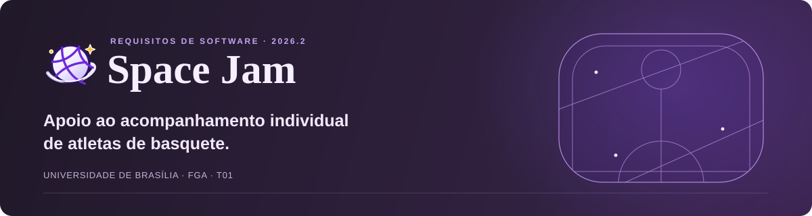

# 

<p align="center">
  <a href="https://fga.unb.br/"></a>
  
</p>

<p align="center">
  <strong><a href="https://mdsreq-fga-unb.github.io/REQ-2026.2-T01-SpaceJam/">Acessar a documentação do projeto ↗</a></strong>
</p>

<p align="center">
  <a href="#sobre-o-projeto">Sobre o projeto</a> ·
  <a href="#documentação">Documentação</a> ·
  <a href="#equipe">Equipe</a> ·
  <a href="#execução-local">Execução local</a>
</p>

## Sobre o projeto

O **Space Jam** é um projeto de uma solução digital para apoiar a gestão e o acompanhamento individual de atletas de basquete orientados pelo treinador **Lucas Cordeiro** ([@cordeirotrainer](https://www.instagram.com/cordeirotrainer/)).

A proposta busca centralizar os registros que hoje ficam distribuídos entre notas, documentos e cadernos: perfil dos atletas, histórico de testes físicos, evolução técnica, lesões e planejamento de treinos. Entre as informações dos testes estão altura, envergadura, *standing reach* e *jump height*.

| Informação | Contexto acadêmico |
| :--- | :--- |
| **Disciplina** | Requisitos de Software · 2026.2 |
| **Instituição** | Universidade de Brasília (UnB) · Campus Faculdade do Gama (FGA) |
| **Docente** | Prof. Dr. George Marsicano |
| **Cliente parceiro** | Lucas Cordeiro · Treinador de basquete |

## Documentação

Consulte o GitHub Pages para acompanhar o conteúdo do projeto.

| Página | Conteúdo |
| :--- | :--- |
| [Visão do Produto e Projeto](https://mdsreq-fga-unb.github.io/REQ-2026.2-T01-SpaceJam/) | Cenário atual, solução proposta e organização do projeto. |
| [Requisitos de Software](https://mdsreq-fga-unb.github.io/REQ-2026.2-T01-SpaceJam/requisitos/) | Requisitos funcionais, não funcionais e rastreabilidade. |
| [Entregas](https://mdsreq-fga-unb.github.io/REQ-2026.2-T01-SpaceJam/entregas/) | Registros e materiais das entregas. |
| [Reuniões](https://mdsreq-fga-unb.github.io/REQ-2026.2-T01-SpaceJam/reunioes/) | Página destinada aos registros de reuniões. |

## Equipe

<table align="center">
  <tr>
    <td align="center" width="33%">
      <a href="https://github.com/juliaamandasl"><br><strong>Julia Amanda</strong></a><br>
      <a href="https://github.com/juliaamandasl"><sub>@juliaamandasl</sub></a>
    </td>
    <td align="center" width="33%">
      <a href="https://github.com/luussato1"><br><strong>Luiz Henrique</strong></a><br>
      <a href="https://github.com/luussato1"><sub>@luussato1</sub></a>
    </td>
    <td align="center" width="33%">
      <a href="https://github.com/Guilherme-Reis-Mendes"><br><strong>Guilherme Mendes</strong></a><br>
      <a href="https://github.com/Guilherme-Reis-Mendes"><sub>@Guilherme-Reis-Mendes</sub></a>
    </td>
  </tr>
  <tr>
    <td align="center" width="33%">
      <a href="https://github.com/Paulosrsr"><br><strong>Paulo Sérgio</strong></a><br>
      <a href="https://github.com/Paulosrsr"><sub>@Paulosrsr</sub></a>
    </td>
    <td align="center" width="33%">
      <a href="https://github.com/code-silva"><br><strong>Anderson Fernandes</strong></a><br>
      <a href="https://github.com/code-silva"><sub>@code-silva</sub></a>
    </td>
    <td align="center" width="33%">
      <a href="https://github.com/OliveiraThiago14"><br><strong>Thiago Oliveira</strong></a><br>
      <a href="https://github.com/OliveiraThiago14"><sub>@OliveiraThiago14</sub></a>
    </td>
  </tr>
</table>

## Estrutura do repositório

```text
.
├── .github/
│   └── workflows/       # Automações de publicação
├── assets/
│   └── readme/          # Identidade visual do README
├── docs/                # Documentação em Markdown e seus recursos
├── README.md            # Apresentação do projeto
├── mkdocs.yml           # Configuração do MkDocs
└── requirements.txt     # Dependências da documentação
```

## Execução local

Para visualizar a documentação no computador, use **Python 3.10 ou superior**, **pip** e um **ambiente virtual**. Os comandos abaixo usam o módulo `venv`, incluído no Python.

### 1. Clonar o repositório

```bash
git clone https://github.com/mdsreq-fga-unb/REQ-2026.2-T01-SpaceJam.git
cd REQ-2026.2-T01-SpaceJam
```

### 2. Criar e ativar o ambiente virtual

**Windows (PowerShell)**

```powershell
python -m venv .venv
.\.venv\Scripts\Activate.ps1
```

**Linux ou macOS**

```bash
python3 -m venv .venv
source .venv/bin/activate
```

### 3. Instalar as dependências

```bash
python -m pip install -r requirements.txt
```

### 4. Iniciar a documentação

```bash
python -m mkdocs serve
```

Abra [http://127.0.0.1:8000/](http://127.0.0.1:8000/) no navegador. Para encerrar o servidor, pressione `Ctrl+C` no terminal.

---

<p align="center"><sub>Space Jam · Requisitos de Software · UnB/FGA · 2026.2</sub></p>
