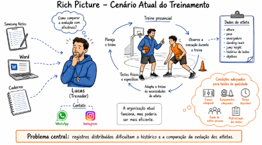
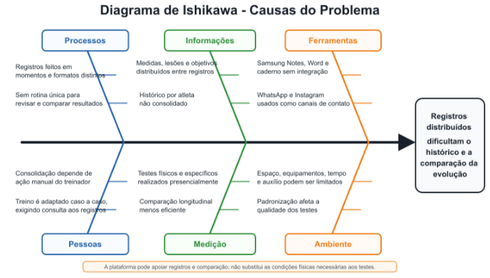

# 1. Cenário Atual do Cliente e do Negócio

## 1.1 Identificação do Cliente/Parceiro

- **Nome:** Lucas Cordeiro (Professor/Treinador de Basquete).
- **Atuação:** Treinador autônomo de basquete, com foco principal em atendimentos individuais e possibilidade de turmas ou escolinhas.
- **Representante:** Lucas Cordeiro.
- **Formas de contato:** WhatsApp, Instagram (@cordeirotrainer) e Google Meet.
- **Vínculo com o projeto:** Cliente real e parte interessada principal, responsável por apresentar e validar informações sobre o negócio, participar da elicitação e confirmar necessidades e requisitos do produto.

## 1.2 Introdução ao Negócio e Contexto

O professor Lucas atua na instrução e no desenvolvimento técnico de atletas de basquete,
principalmente por meio de treinos presenciais individuais. O acompanhamento ocorre durante as
aulas, com observação da execução e aplicação de testes físicos e específicos da modalidade. A partir
dos resultados e das necessidades de cada atleta, Lucas adapta o treinamento.

O contato com atletas e potenciais clientes ocorre pelo WhatsApp e pelo Instagram
(@cordeirotrainer). Para planejar e organizar treinos e informações dos atletas, Lucas utiliza
Samsung Notes, Word e um caderno. Além disso, será utilizado o Google Meet para futuras reuniões.

Durante o treino presencial, Lucas demonstra exercícios, observa e corrige a execução, realiza
testes e ajusta o planejamento. Entre as informações que considera relevantes estão altura, peso,
envergadura, standing reach, jump height, histórico de lesões e objetivos.

A organização atual funciona, mas poderia ser mais eficiente. Como os registros ficam distribuídos
entre Samsung Notes, Word e caderno, localizar informações, manter um histórico e comparar a
evolução dos atletas exige consolidação manual. Além disso, a qualidade dos testes depende de
condições adequadas de espaço, equipamentos, tempo, auxílio de outras pessoas e padronização.

## 1.3 Rich Picture

A Rich Picture a seguir representa somente o cenário atual: contato por WhatsApp e Instagram, organização em Samsung Notes, Word e caderno, treinos e testes presenciais, adaptação individual e dificuldades de histórico e comparação.

*Figura 1 — Rich Picture do cenário atual do acompanhamento dos atletas.*

## 1.4 Identificação da Oportunidade ou Problema

### Problema central

Os registros de planejamento, perfil e resultados de testes ficam distribuídos entre Samsung Notes,
Word e caderno, o que torna menos eficiente manter o histórico e comparar a evolução dos atletas.

### Problemas observados

- **Registros distribuídos:** planejamento, dados do atleta e resultados dos testes são mantidos
em ferramentas distintas.
- **Histórico fragmentado:** a consulta da trajetória de cada atleta depende da reunião manual
dos registros.
- **Comparação menos eficiente:** acompanhar mudanças nas medidas e nos resultados ao
longo do tempo exige consolidação manual.
- **Restrição operacional dos testes:** a qualidade dos testes presenciais depende de
espaço, equipamentos, tempo, auxílio e padronização adequados.

### Análise das causas

As causas foram organizadas nas categorias Processos, Informações, Ferramentas, Pessoas,
Medição e Ambiente. O diagrama de Ishikawa evidencia a combinação entre registros feitos em
momentos e formatos distintos, informações distribuídas, ausência de integração entre Samsung
Notes, Word e caderno, consolidação manual, comparação longitudinal pouco eficiente e limitações
nas condições de realização dos testes.

*Figura 2 — Diagrama de Ishikawa das causas da fragmentação dos registros e da comparação menos eficiente.*

### Oportunidade

Há a oportunidade de centralizar o perfil do atleta, resultados de testes, planejamento, exercícios e
histórico, tornando a consulta e a comparação da evolução mais eficientes. Lucas confirmou que uma
plataforma com esses elementos resolveria uma dificuldade relevante de sua rotina. A solução
poderá apoiar o registro e a análise das informações, sem substituir as condições físicas necessárias
à realização de testes de qualidade.

## 1.5 Desafios do Projeto

- **Elicitação e validação:** compreender a rotina real do treinador e validar decisões com
Lucas, cuja disponibilidade pode influenciar o ritmo das entrevistas.

- **Delimitação entre problema e solução:** manter a documentação do cenário atual separada
das decisões sobre o produto proposto.

- **Privacidade e consentimento:** tratar vídeos de atletas e feedbacks individuais como
informações privadas, com acesso restrito.

- **Condições de teste e limites da solução:** reconhecer que a plataforma apoia registros,
histórico e comparação, mas não substitui espaço, equipamentos, tempo, auxílio ou
padronização necessários aos testes.

- **Restrição de escopo acadêmico:** priorizar um MVP realizável durante a disciplina e
manter ranking, métricas avançadas e expansão para outras modalidades como evoluções futuras.

## 1.7 Segmentação de "Clientes" (Usuários da Plataforma)

### Professor/Treinador

**Perfil de negócio:** treinador autônomo responsável por planejar treinos, demonstrar exercícios,
observar a execução e fornecer correções individualizadas.

**Perfil tecnológico considerado:** utiliza smartphone, WhatsApp e Instagram para contato, além de
Samsung Notes, Word e caderno para organizar treinos e informações. A proposta deve exigir
operações simples de cadastro, consulta, registro, comparação e compartilhamento de conteúdo.

### Atletas

**Perfil de uso:** praticantes de basquete em diferentes níveis de experiência, acompanhados
principalmente em treinos presenciais. Para o acompanhamento individual, Lucas considera altura,
peso, envergadura, standing reach, jump height, histórico de lesões e objetivos.

**Perfil tecnológico considerado:** acesso a smartphone com câmera, navegador e internet, além de
familiaridade básica com mensagens, reprodução e envio de vídeos.

**Limites das informações disponíveis:** faixa etária predominante, quantidade de atletas,
dispositivos mais utilizados e necessidades específicas de acessibilidade ainda dependem de
validação com Lucas.
