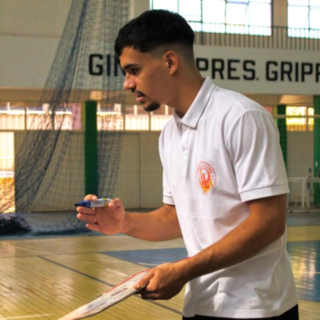

<section class="sj-hero">
  

    Projeto acadêmico
    Requisitos de Software · 2026.2
  

  <h1>Space Jam</h1>
  
Apoio ao acompanhamento individual de atletas de basquete.

  
Uma plataforma web concebida para reunir informações que hoje ficam distribuídas entre diferentes ferramentas e apoiar a rotina do treinador Lucas Cordeiro e de seus atletas.

  

    <a class="sj-button sj-button--primary" href="cenario_atual/">Entender o cenário</a>
    <a class="sj-button sj-button--secondary" href="solucao/">Conhecer a solução</a>
  

  
Documentação em evolução

</section>

<section class="sj-section" aria-labelledby="visao-projeto">
  

    
Visão geral

    <h2 id="visao-projeto">Do problema observado à oportunidade</h2>
  

  

    <article class="sj-card">01<h3>Problema</h3>
Registros de atletas e treinos ficam dispersos entre Samsung Notes, Word e caderno.
</article>
    <article class="sj-card">02<h3>Oportunidade</h3>
Centralizar perfis, testes, exercícios, planos e histórico para tornar o acompanhamento mais eficiente.
</article>
    <article class="sj-card">03<h3>Pessoas</h3>
Lucas Cordeiro, responsável pelo acompanhamento, e os atletas orientados por ele.
</article>
  

</section>

<section class="sj-section" aria-labelledby="explore-documentacao">
  

    
Documentação

    <h2 id="explore-documentacao">Comece pelos principais artefatos</h2>
  

  

    <a class="sj-reading-card" href="cenario_atual/">01<strong>Cenário atual</strong><small>Contexto, problema, stakeholders e necessidades.</small></a>
    <a class="sj-reading-card" href="solucao/">02<strong>Solução proposta</strong><small>Objetivos e características pensadas para o produto.</small></a>
    <a class="sj-reading-card" href="intervencao_social/">03<strong>Intervenção social</strong><small>Impactos pretendidos, efeitos emergentes e limites da solução.</small></a>
    <a class="sj-reading-card" href="engenharia_requisitos/">05<strong>Engenharia de Requisitos</strong><small>Atividades, práticas e técnicas utilizadas no projeto.</small></a>
    <a class="sj-reading-card" href="cronograma/">06<strong>Cronograma e Entregas</strong><small>Ciclos RAD, resultados esperados e formas de validação.</small></a>
    <a class="sj-reading-card" href="interacao_equipe_cliente/">07<strong>Interações</strong><small>Comunicação, validação e registro das decisões.</small></a>
    <a class="sj-reading-card" href="licoes-aprendidas/">11<strong>Lições aprendidas</strong><small>Aprendizados da equipe e ações de melhoria para as próximas unidades.</small></a>
    <a class="sj-reading-card" href="reunioes/">R<strong>Reuniões</strong><small>Índice reservado para atas e decisões do projeto.</small></a>
  

</section>

<section class="sj-section" aria-labelledby="perspectivas-uso">
  

    
Perspectivas de uso

    <h2 id="perspectivas-uso">Uma visão para cada participante</h2>
  

  

    <article class="sj-role-card sj-role-card--trainer">
      
      
T
Lucas Cordeiro<small>Treinador</small>

      <ul><li>Prescrição de treinos e rotinas</li><li>Registro de testes físicos</li><li>Acompanhamento da evolução</li><li>Feedback privado e individual</li></ul>
    </article>
    <article class="sj-role-card">
      
A
Usuário acompanhado<small>Atleta</small>

      <ul><li>Consulta de plano e orientações</li><li>Biblioteca de exercícios</li><li>Envio opcional de vídeo</li><li>Visualização do histórico</li></ul>
    </article>
  

</section>

<section class="sj-section" aria-labelledby="equipe-space-jam">
  

    
Equipe

    <h2 id="equipe-space-jam">Stakeholders Anônimos</h2>
  

  <ul class="sj-team-grid">
    <li><a href="https://github.com/code-silva" target="_blank" rel="noopener noreferrer"><strong>Anderson Fernandes da Silva</strong><small>@code-silva</small></a></li>
    <li><a href="https://github.com/Guilherme-Reis-Mendes" target="_blank" rel="noopener noreferrer"><strong>Guilherme Ferreira Mendes</strong><small>@Guilherme-Reis-Mendes</small></a></li>
    <li><a href="https://github.com/juliaamandasl" target="_blank" rel="noopener noreferrer"><strong>Júlia Amanda Silva Lima</strong><small>@juliaamandasl</small></a></li>
    <li><a href="https://github.com/luussato1" target="_blank" rel="noopener noreferrer"><strong>Luiz Henrique Pessato da Mota</strong><small>@luussato1</small></a></li>
    <li><a href="https://github.com/Paulosrsr" target="_blank" rel="noopener noreferrer"><strong>Paulo Sergio Rabelo Santana Rios</strong><small>@Paulosrsr</small></a></li>
    <li><a href="https://github.com/OliveiraThiago14" target="_blank" rel="noopener noreferrer"><strong>Thiago Alencar de Oliveira</strong><small>@OliveiraThiago14</small></a></li>
  </ul>
</section>
