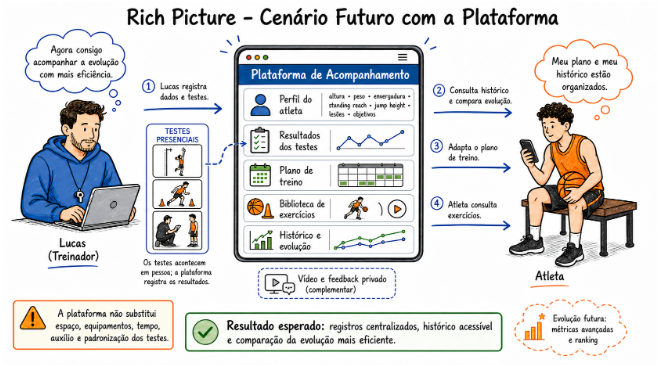

# 2 Solução Proposta

## 2.1 Objetivo Geral do Produto

O objetivo geral do produto é tornar mais eficiente o acompanhamento individual dos atletas de Lucas, por meio de uma aplicação web responsiva capaz de centralizar informações de perfil, resultados de testes, planejamento, exercícios, treinos e histórico de evolução.

A solução busca reduzir a dispersão das informações utilizadas no acompanhamento dos atletas, facilitando o acesso aos dados relevantes para o treinador e permitindo que cada atleta consulte seus exercícios, orientações e histórico de forma organizada.

Como recurso complementar aos encontros presenciais, a solução também permitirá o envio privado e opcional de vídeos vinculados aos exercícios, possibilitando que o treinador forneça feedback individualizado ao atleta. Esse recurso não tem como objetivo substituir a análise presencial do treinador, mas complementar o acompanhamento realizado durante os treinos.

Dessa forma, o produto pretende oferecer um ambiente único para organização, acompanhamento e comunicação entre treinador e atleta, respeitando as particularidades e necessidades individuais de cada usuário.

A figura a seguir representa exclusivamente o cenário futuro apoiado pela solução proposta,
mantendo a descrição do cenário atual restrita à Seção 1.

*Figura 3 — Rich Picture do cenário futuro apoiado pela solução proposta.*

## 2.2 Objetivos Específicos (OE) do Produto

- OE1 — Reduzir a dispersão dos dados de perfil, testes, planejamento e treinos, tornando mais eficiente a consulta do histórico e a comparação da evolução de cada atleta.

- OE2 — Apoiar a organização e adaptação dos treinamentos considerando os objetivos, histórico de lesões, resultados dos testes, exercícios e orientações específicas de cada atleta.

- OE3 — Oferecer, como recurso complementar, um fluxo rastreável entre exercício, vídeo enviado e feedback privado.

- OE4 — Preservar a privacidade dos dados, vídeos e orientações individuais de cada atleta.

## 2.3 Características do Produto

As características apresentadas a seguir foram definidas considerando os objetivos específicos do produto e as necessidades identificadas no contexto do cliente.

| OE principal | ID | Contribuição secundária | Característica | Descrição resumida | Valor de negócio principal |
|---|---|---|---|---|---|
| OE1 | C1 | OE2 | Cadastro do perfil do atleta | Cadastro de informações como altura, peso, envergadura, standing reach, jump height, histórico de lesões e objetivos. | Centralizar as principais informações individuais do atleta. |
| OE1 | C2 | OE2 | Registro de resultados dos testes | Permitir o registro dos resultados de testes físicos e específicos realizados pelos atletas. | Facilitar o acompanhamento do desempenho e da evolução. |
| OE1 | C3 | OE2 | Registro do planejamento | Permitir ao treinador cadastrar e consultar o planejamento individual de cada atleta. | Organizar o planejamento e reduzir a dispersão das informações. |
| OE1 | C4 | OE2 | Histórico de treinos | Registrar os treinos realizados e permitir sua consulta posteriormente. | Facilitar o acompanhamento da trajetória do atleta. |
| OE1 | C5 | OE2 | Histórico integrado | Reunir informações de perfil, testes, planejamento e treinos em um histórico individual. | Facilitar a consulta e a comparação da evolução do atleta. |
| OE2 | C6 | OE1 | Biblioteca de exercícios | Organizar exercícios por objetivo e fundamento, como arremesso, drible, passe, defesa, condicionamento, mobilidade e coordenação. | Facilitar a seleção e organização dos exercícios conforme a necessidade de cada atleta. |
| OE2 | C7 | OE1 | Vídeos demonstrativos | Disponibilizar vídeos demonstrativos associados aos exercícios. | Facilitar a compreensão da execução dos exercícios. |
| OE2 | C8 | OE1 | Instruções e erros comuns | Apresentar orientações sobre execução e principais erros relacionados a cada exercício. | Auxiliar o atleta na execução adequada das atividades. |
| OE2 | C9 | OE1 | Orientações individuais | Permitir que o treinador disponibilize orientações específicas para cada atleta. | Apoiar a individualização do treinamento. |
| OE3 | C10 | OE4 | Envio privado de vídeos | Permitir que o atleta envie opcionalmente um vídeo relacionado à execução de determinado exercício. | Criar um canal complementar para acompanhamento remoto. |
| OE3 | C11 | OE4 | Feedback privado | Permitir que o treinador registre um feedback relacionado ao vídeo e ao exercício enviado. | Melhorar a comunicação e o acompanhamento entre treinador e atleta. |
| OE3 | C12 | OE1 | Rastreamento do feedback | Associar o vídeo enviado ao exercício correspondente e ao feedback realizado pelo treinador. | Garantir maior organização e rastreabilidade do acompanhamento remoto. |
| OE4 | C13 | OE1 | Perfis distintos de acesso | Diferenciar os acessos e permissões de treinador e atleta. | Garantir que cada usuário visualize somente as informações pertinentes ao seu perfil. |
| OE4 | C14 | OE3 | Privacidade de vídeos e feedbacks | Restringir o acesso aos vídeos enviados e aos feedbacks realizados pelo treinador. | Proteger informações e conteúdos individuais dos atletas. |
| OE4 | C15 | OE1 | Proteção dos dados individuais | Manter informações pessoais, testes, objetivos e histórico vinculados ao respectivo atleta. | Preservar a confidencialidade das informações armazenadas. |

### Escopo inicial do produto

Para o desenvolvimento do MVP, serão priorizadas as funcionalidades consideradas essenciais para atender aos objetivos do produto: cadastro dos atletas, gerenciamento do perfil, registro de testes, planejamento individual, biblioteca de exercícios, histórico de treinos, envio privado de vídeos e registro de feedbacks.

Funcionalidades mais complexas, como análise automática de vídeo, ranking por frequência ou qualidade observada, métricas avançadas, suporte a turmas e expansão para outras modalidades esportivas, permanecerão fora do escopo do MVP.

Essas funcionalidades poderão ser consideradas como possibilidades de evolução futura do produto, caso o MVP demonstre viabilidade e utilidade para o cliente.

## 2.4 Tecnologias a Serem Utilizadas

A solução será desenvolvida como uma **aplicação web responsiva**, tendo como plataforma principal de utilização os **computadores**, mas oferecendo compatibilidade com dispositivos móveis, como smartphones e tablets. Dessa forma, a interface deverá se adaptar a diferentes tamanhos de tela, garantindo uma experiência adequada tanto para o treinador quanto para os atletas.

Para o desenvolvimento da interface, propõe-se a utilização do **React**, permitindo a construção de componentes reutilizáveis e de uma interface organizada e responsiva.

No desenvolvimento do back-end, será utilizada a linguagem **Python**, responsável pela implementação das regras de negócio, gerenciamento das requisições, autenticação dos usuários e comunicação com o banco de dados. A definição do framework a ser utilizado em Python poderá ser realizada durante a etapa de implementação, considerando as necessidades do projeto e o conhecimento técnico da equipe.

Para o armazenamento dos dados, será utilizado o **PostgreSQL**, um banco de dados relacional que permitirá estruturar informações referentes aos atletas, testes, exercícios, planejamentos, treinos, vídeos e feedbacks.

Para o armazenamento dos arquivos de vídeo, poderá ser utilizada uma solução de armazenamento em nuvem, permitindo que os arquivos de mídia sejam armazenados separadamente dos dados estruturados da aplicação.

O controle de versão do projeto será realizado utilizando **Git**, possibilitando o desenvolvimento colaborativo, o acompanhamento das alterações e a organização do código produzido pela equipe.

A aplicação também contará com mecanismos de **autenticação e controle de acesso**, diferenciando as permissões entre treinador e atleta. Dessa forma, cada atleta poderá acessar suas próprias informações, enquanto o treinador terá acesso aos dados dos atletas sob seu acompanhamento.

A escolha das tecnologias considera a necessidade de desenvolver uma solução funcional dentro do prazo da disciplina, utilizando ferramentas compatíveis com o conhecimento técnico da equipe e que permitam futuras evoluções do produto.

## 2.5 Pesquisa de Mercado e Análise Competitiva

Foram analisadas plataformas voltadas para treinamento esportivo, basquete, acompanhamento de atletas e feedback por vídeo. A comparação considera as principais funcionalidades e sua relação com o contexto do cliente.

| Plataforma | Principais funcionalidades | Relação com o contexto do cliente |
|---|---|---|
| HomeCourt | exercícios interativos de basquete, uso da câmera, estatísticas e feedback em tempo real. | foco em análise automática e gamificação; não reproduz a personalização do método de Lucas. |
| Onform | gravação/análise de vídeo, câmera lenta, anotações, comparação e feedback. | atende múltiplos esportes, com análise de vídeo além do MVP proposto. |
| TrainHeroic | biblioteca de treinos, acompanhamento de atletas, vídeo, comunicação e controle de aderência. | solução ampla de força/condicionamento, sem foco nos fundamentos do basquete. |

Fontes oficiais: HomeCourt, Onform, TrainHeroic.

Enquanto essas plataformas são mais genéricas, o produto a ser desenvolvido tende a ser mais personalizado para cada usuário, com foco específico no basquete. Logo, o diferencial é centralizar perfil, testes, planejamento, exercícios e histórico com base no método de Lucas. Além disso, vídeos e feedback serão utilizados como recursos complementares, enquanto a análise automática, o ranking e as métricas avançadas ficam fora do escopo do MVP.

## 2.6 Viabilidade da Proposta

A proposta é considerada viável no contexto da disciplina, principalmente devido à possibilidade de delimitação do escopo e priorização das funcionalidades essenciais para a construção de um MVP funcional.

O produto possui uma estrutura que pode ser dividida em módulos relativamente independentes, como cadastro de atletas, exercícios, testes, planejamento, histórico e comunicação por vídeo. Essa divisão permite que a equipe desenvolva e valide as funcionalidades de maneira incremental.

As tecnologias propostas são amplamente utilizadas no desenvolvimento de aplicações web, o que reduz os riscos relacionados à implementação. Além disso, a arquitetura proposta permite que funcionalidades mais complexas sejam deixadas para etapas futuras sem comprometer o funcionamento do MVP.

Outro fator favorável é a possibilidade de contato com o cliente durante o desenvolvimento. A participação do treinador permitirá validar se as funcionalidades desenvolvidas correspondem ao seu método de trabalho e às necessidades dos atletas.

O principal risco está relacionado ao prazo da disciplina, especialmente no desenvolvimento do fluxo de vídeos e no gerenciamento adequado dos dados. Por esse motivo, funcionalidades de maior complexidade, como análise automática de vídeos, métricas avançadas, rankings e suporte a múltiplas turmas, foram explicitamente mantidas fora do MVP.

Considerando o escopo definido, as tecnologias propostas, a possibilidade de contato com o cliente e a priorização das funcionalidades essenciais, a equipe considera possível entregar um MVP funcional ao final do semestre.

## 2.7 Benefícios Esperados

### 2.7.1 Benefícios para o cliente

A implementação da solução deverá proporcionar ao treinador os seguintes benefícios:

- **Centralização das informações:** reunir perfil, testes, planejamento, exercícios e histórico dos atletas em um único ambiente.

- **Redução da dispersão dos dados:** diminuir a necessidade de consultar diferentes meios para localizar informações relacionadas a cada atleta.

- **Maior eficiência no acompanhamento:** facilitar a consulta do histórico e dos resultados obtidos ao longo do tempo.

- **Apoio à tomada de decisão:** disponibilizar informações organizadas que auxiliem na adaptação dos treinamentos às necessidades individuais.

- **Melhor organização dos exercícios:** permitir a criação e manutenção de uma biblioteca estruturada de exercícios, instruções e vídeos demonstrativos.

- **Maior rastreabilidade:** relacionar exercícios, vídeos enviados e feedbacks realizados pelo treinador.

- **Melhoria na comunicação com os atletas:** disponibilizar orientações e feedbacks individuais de forma organizada e privada.

- **Possibilidade de evolução futura:** estabelecer uma base que poderá receber novas funcionalidades conforme as necessidades do treinador e dos atletas.

### 2.7.2 Benefícios para os usuários

Para os **atletas**, espera-se que o produto proporcione:

- acesso facilitado aos exercícios e orientações;
- consulta do planejamento individual;
- visualização do próprio histórico de treinos e resultados;
- maior compreensão dos exercícios por meio de vídeos demonstrativos;
- possibilidade de enviar vídeos para avaliação do treinador;
- recebimento de feedback individualizado;
- maior organização das informações relacionadas ao próprio treinamento;
- maior privacidade dos dados, vídeos e feedbacks.

Para o treinador, além dos benefícios relacionados à organização das informações, espera-se uma redução do esforço necessário para localizar dados individuais e acompanhar a evolução dos atletas.

De maneira geral, o produto deverá contribuir para um acompanhamento mais organizado, individualizado e rastreável, funcionando como uma ferramenta de apoio ao trabalho presencial do treinador, sem substituir sua avaliação profissional durante os treinos.

## Histórico de Versão

| Data | Versão | Descrição | Autor |
| --- | --- | --- | --- |
| 07/09/2026 | 0.2 | Adequação da comunicação e da validação às decisões registradas na reunião da equipe. | Paulo Sergio Rabelo Santana Rios |
| 07/09/2026 | 0.1 | Elaboração inicial da seção de solução proposta. | Júlia Amanda Silva Lima |

